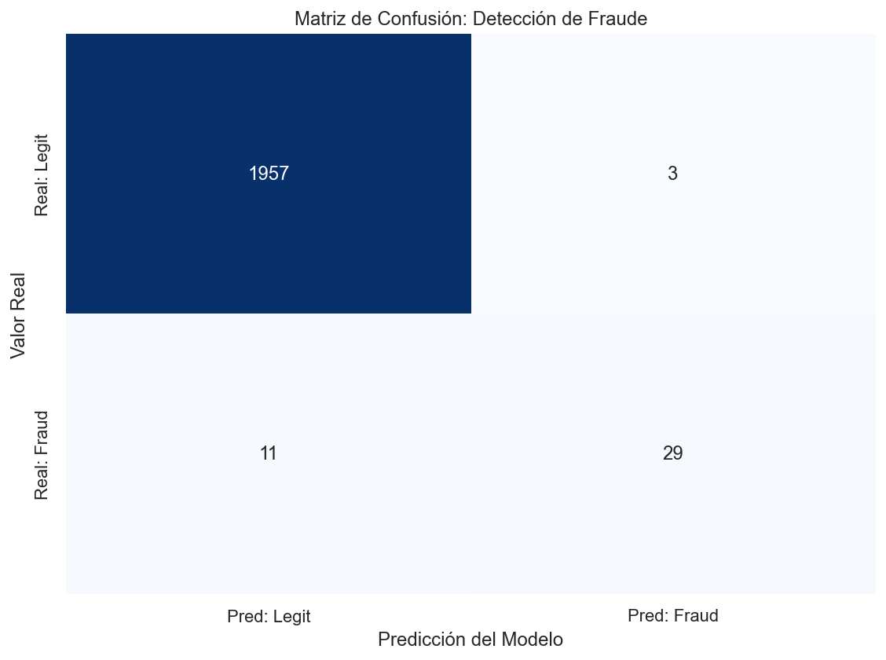

## Project Overview
This project simulates a critical challenge in the Fintech and Banking sectors: **detecting fraudulent transactions** within a massive stream of legitimate payments. 

In real-world scenarios, fraud represents less than 1% of data. A standard model could achieve 99% accuracy by simply saying "No Fraud" every time, but it would fail to catch the criminals. This project focuses on **handling imbalanced datasets** and prioritizing metrics like **Recall** and **Precision** over simple Accuracy.

## Tech Stack
*   **Python**: Core logic.
*   **Scikit-Learn**: Machine Learning implementation (Random Forest) and data splitting.
*   **Pandas & NumPy**: Synthetic data generation and manipulation.
*   **Seaborn & Matplotlib**: Visualization of the Confusion Matrix.

## Key Features

### 1. Synthetic Data Generation (Imbalanced)
Created a dataset of 10,000 transactions where only **2%** are fraudulent.
*   **Legitimate Trans (Class 0):** Generated using normal distribution (lower amounts, stable patterns).
*   **Fraud Trans (Class 1):** Generated with higher variance to simulate anomalies.
*   **Stratification:** Used `stratify=y` during the train-test split to ensure the model trains on the correct proportion of fraud cases.

### 2. Machine Learning Model
Implemented a **Random Forest Classifier**.
*   **Why Random Forest?** It handles tabular data excellently and is robust against overfitting compared to single Decision Trees.
*   **Preprocessing:** Applied `StandardScaler` to normalize transaction amounts and activity scores.

### 3. Evaluation Strategy
Instead of relying on Accuracy (which is misleading here), I focused on the **Confusion Matrix**:
*   **True Positives (TP):** Frauds correctly identified.
*   **False Negatives (FN):** Frauds missed (The most dangerous error in banking).
*   **False Positives (FP):** Legitimate users blocked (Customer friction).

## Visualizations

The script generates a Confusion Matrix to visually evaluate the model's performance on the test set.



*Figure 1: The matrix shows the model's ability to distinguish between legitimate and fraudulent classes. The goal is to maximize the number in the bottom-right square (True Positives).*

## How to Run

1.  Clone the repository:
    ```bash
    git clone https://github.com/DanielVegaRosado/financial-fraud-detection.git
    ```
2.  Install dependencies:
    ```bash
    pip install pandas numpy scikit-learn matplotlib seaborn
    ```
3.  Run the script:
    ```bash
    python main.py
    ```

## Results
The model achieves a high detection rate for the minority class (Fraud) while maintaining a low false alarm rate for legitimate users, demonstrating the effectiveness of Supervised Learning for Anomaly Detection.

---

*Author: Daniel Vega Rosado | Computer Engineering Student*
